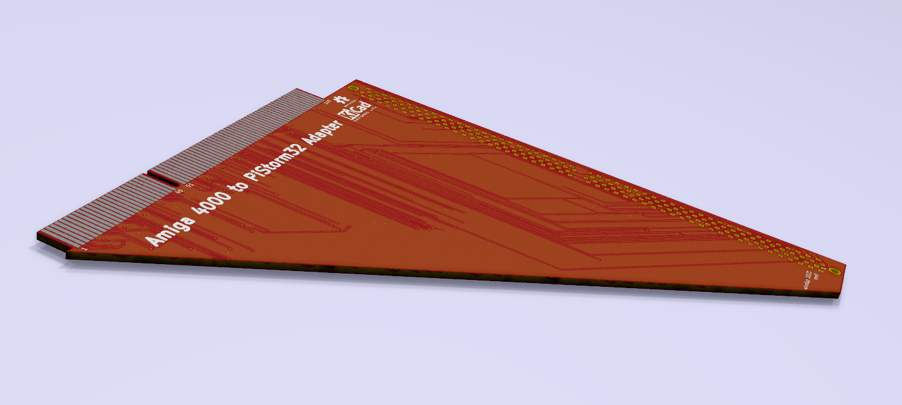

# A1200 to A3000/A4000 CPU Adapter
An adapter to use an A1200 CPU in an Amiga 3000 or 4000. Targed for Pistorm32 use only.

## Info
Preliminary rev for test purposes only. May not work. Included in the repository are the KiCAD v5 footprints and symbols for the A1200 and A4000 connectors. Autorouted traces and it requires schematic verification. Measurements of the rough PCB outline are not verified. The intent of this connector is to adapt the Pistorm32 for use in the Amiga 4000, possibly the Amiga 3000. It is not known if it will work yet..
