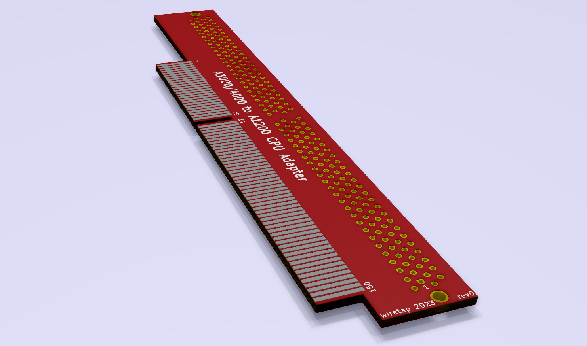

# A1200 to A3000/A4000 CPU Adapter
An adapter to use an A1200 CPU in an Amiga 3000 or 4000. Targed for Pistorm32 use.

## Info
Preliminary rev. Included in the repository are the KiCAD v5 footprints and symbols for the A1200 and A4000 connectors. There are no schematic connections and no traces. Measurements of the rough PCB outline are not verified. The intent of this connector is to adapt the Pistorm32 for use in the Amiga 3000 or Amiga 4000.
